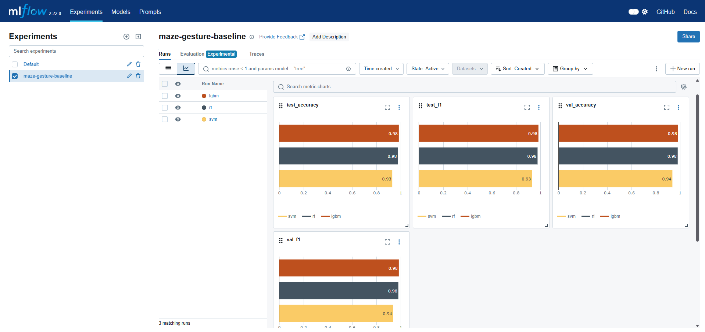
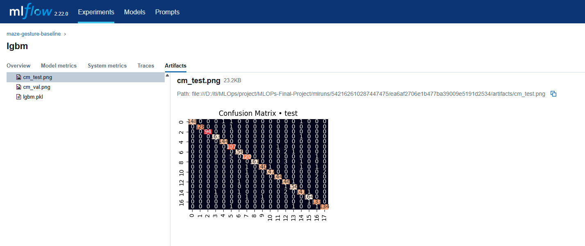
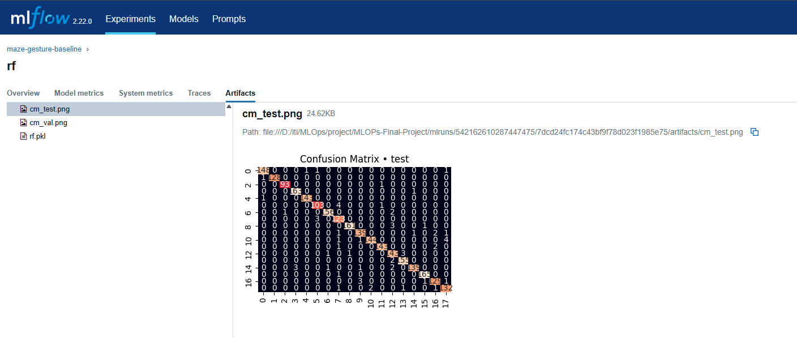
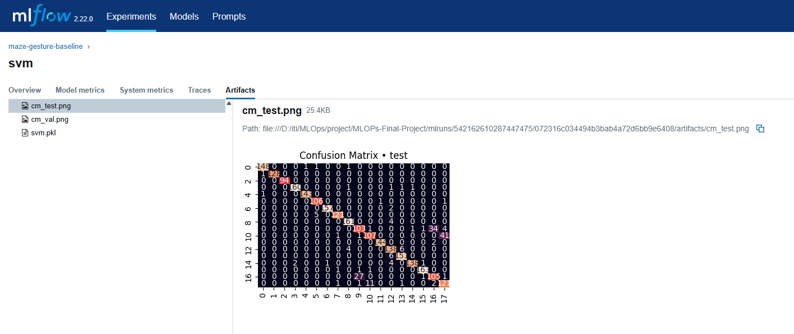

# 🎮 Astray: Gesture-Controlled 3D Maze Game - research

A machine learning project that trains models to recognize hand gestures for controlling a 3D maze game. The project uses computer vision and machine learning to process hand landmarks and predict gestures.

## ✨ Features

- 🤚 Hand gesture recognition using machine learning
- 🧠 Multiple model implementations (SVM, Random Forest, LightGBM)
- 📊 MLflow integration for experiment tracking
- 🔄 Data preprocessing and normalization
- 📈 Model evaluation with confusion matrices
- ✅ Cross-validation and performance metrics

## 🏆 Model Performance

Among the three implemented models (SVM, Random Forest, and LightGBM), LightGBM demonstrated the best performance in terms of:
- 🎯 Higher accuracy on both validation and test sets
- 📈 Better F1 scores
- ⚡ Faster training and inference times
- 🎯 More robust predictions across different gesture classes







## 📋 Requirements

- 🐍 Python 3.x
- 📦 Dependencies listed in `requirements.txt`:
  - mlflow >= 2.12.0
  - scikit-learn >= 1.4.2
  - lightgbm >= 4.1.0
  - opencv-python-headless >= 4.12.0
  - pandas >= 2.2.2
  - numpy >= 1.26.4
  - joblib >= 1.4.0

## 🚀 Installation

1. Clone the repository:
```bash
git clone https://github.com/yourusername/Astray-Gesture-controlled-3D-Maze-Game.git
cd Astray-Gesture-controlled-3D-Maze-Game
```

2. Install dependencies:
```bash
pip install -r requirements.txt
```

## 💻 Usage

### 🎯 Training Models

To train the gesture recognition models:

```bash
python train.py --data data/hand_landmarks_data.csv --models svm rf lgbm --out_dir models
```

Arguments:
- `--data`: Path to the hand landmarks dataset (default: "data/hand_landmarks_data.csv")
- `--models`: List of models to train (default: ["svm", "rf", "lgbm"])
- `--out_dir`: Directory to save trained models (default: "models")

### 🔧 Data Preprocessing

The training script includes preprocessing steps:
- 🧹 Drops NaN values
- 📍 Anchors all landmarks at the wrist
- 📏 Normalizes coordinates using wrist-to-mid-finger-tip distance
- 📊 Splits data into train/validation/test sets (80/10/10)

### 📊 Model Evaluation

The training process evaluates models using:
- 🎯 Accuracy score
- 📈 F1 score
- 📊 Confusion matrices (saved as PNG files)

Results are logged using MLflow for experiment tracking.

## 📁 Project Structure

```
.
├── 📂 data/               # Dataset directory
├── 📂 models/            # Trained model outputs
├── 📂 mlruns/           # MLflow experiment tracking
├── 📄 train.py          # Training script
└── 📄 requirements.txt  # Project dependencies
```
