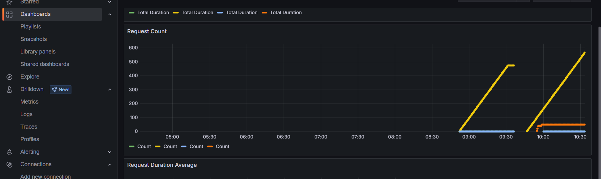
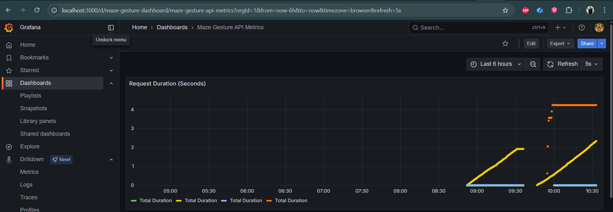
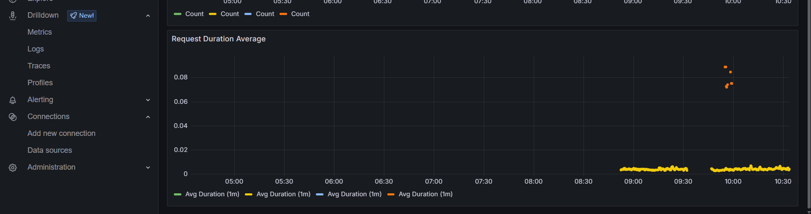

# 🎮 Maze Gesture API

A RESTful API service that provides real-time hand gesture recognition capabilities for controlling a 3D maze game. This API processes hand landmarks using MediaPipe and returns predicted gestures using a trained model.

## ✨ Features

- 🤚 Real-time hand gesture recognition using MediaPipe
- 🚀 FastAPI-powered endpoints with automatic OpenAPI documentation
- ⚡ Async request handling for better performance
- 📊 Prometheus metrics and Grafana dashboards
- 🔄 Docker containerization
- 🧪 Comprehensive test suite
- 🔒 Built-in request validation and security

## 📋 Requirements

- 🐍 Python 3.x
- 📦 Dependencies listed in `requirements.txt`:
  - fastapi
  - uvicorn
  - prometheus_fastapi_instrumentator
  - python-multipart
  - opencv-python
  - joblib
  - numpy
  - mediapipe
  - pytest
  - httpx

## 🚀 Installation

1. Clone the repository:
```bash
git clone https://github.com/yourusername/maze-gesture-api.git
cd maze-gesture-api
```

2. Install dependencies:
```bash
pip install -r requirements.txt
```

## 💻 Usage

### 🏃‍♂️ Running with Docker

Start the services using Docker Compose:
```bash
docker-compose up -d
```

This will start:
- 🚀 FastAPI application
- 📊 Prometheus metrics server
- 📈 Grafana dashboards

### 🏃‍♂️ Running Locally

Start the API server:
```bash
uvicorn app.main:app --host 0.0.0.0 --port 8000 --reload
```

### 📡 API Endpoints

#### POST `/predict`
Predicts the gesture from hand landmarks.

Request body:
```json
{
    "landmarks": [
        [x1, y1, z1],
        [x2, y2, z2],
        ...
    ]
}
```

Response:
```json
{
    "gesture": "gesture_name",
    "confidence": 0.95,
    "timestamp": "2024-02-20T12:00:00Z"
}
```

### 🔧 Configuration

The API can be configured through environment variables:
- `PORT`: API server port (default: 8000)
- `HOST`: API server host (default: 0.0.0.0)

## 📁 Project Structure

```
.
├── 📂 app/              # Main application code
│   ├── 📄 main.py      # FastAPI application
│   ├── 📄 models.py    # Pydantic models
├── 📂 tests/           # Test suite
├── 📂 grafana/         # Grafana dashboard configurations
├── 📄 dockerfile      # Docker configuration
├── 📄 docker-compose.yml # Docker services configuration
├── 📄 prometheus.yml  # Prometheus configuration
└── 📄 requirements.txt # Project dependencies
```

## 🔍 API Documentation

FastAPI automatically generates interactive API documentation:
- 📚 Swagger UI: `http://localhost:8000/docs`
- 📖 ReDoc: `http://localhost:8000/redoc`
- 📊 Grafana dashboards: `http://localhost:3000`
- 📈 Prometheus metrics: `http://localhost:9090`

## 🧪 Testing

Run the test suite:
```bash
pytest tests/
```

## 📈 Monitoring

The application includes:
- 📊 Prometheus metrics collection
- 📈 Grafana dashboards for visualization
- 🔍 API performance monitoring
- ⚡ Real-time metrics





